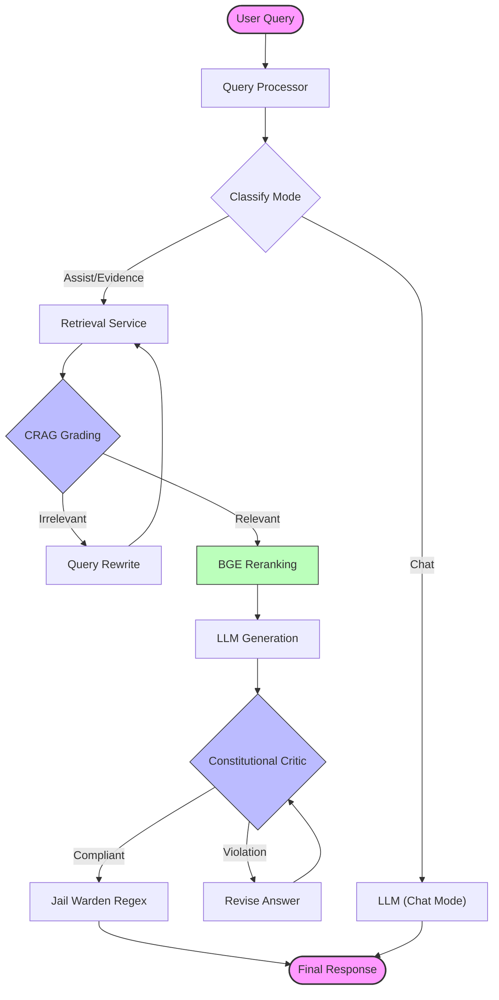

# Constitutional AI

> **A Production-Grade RAG System for Swedish Government Documents**


**Constitutional AI** is an advanced Retrieval-Augmented Generation (RAG) system specifically designed to handle over **535,000+ Swedish government documents** (SOU, Ds, Propositioner, etc.). Unlike standard RAG systems, it employs an **agentic architecture** using **LangGraph** to ensure answers strictly adhere to Swedish constitutional principles: **Legality**, **Objectivity**, and **Transparency**.

---

## 📚 Table of Contents

- [About the Project](#-about-the-project)
- [RAG Architecture](#-rag-architecture)
- [Key Features](#-key-features)
- [Tech Stack](#-tech-stack)
- [Getting Started](#-getting-started)
  - [Prerequisites](#prerequisites)
  - [Installation](#installation)
- [Usage](#-usage)
  - [Running the System](#running-the-system)
  - [API Example](#api-example)
- [Configuration](#-configuration)
- [Contributing](#-contributing)
- [License](#-license)

---

## 📖 About the Project

Constitutional AI was built to solve the challenge of hallucination in legal AI. By implementing a "Constitutional" framework, the system does not just retrieve information; it **grades**, **critiques**, and **refines** its own answers before presenting them to the user.

The system indexes a massive corpus of Swedish legal text (ChromaDB) and uses a custom-tuned **Corrective RAG (CRAG)** pipeline to verify that every claim is backed by a citation from the source material. Smart chunking with **SFS boundary detection** ensures that legal paragraphs (kapitel, paragraf) are preserved intact.

---

## 🧠 RAG Architecture

The system uses **LangGraph** to orchestrate a state-machine based workflow.



---

## ✨ Key Features

*   **Agentic Workflow:** Uses **LangGraph** to create cyclical flows (Retrieval → Grading → Reranking → Generation → Critique).
*   **Corrective RAG (CRAG):** **Enabled by default.** Automatically grades retrieved documents for relevance. If documents are irrelevant, the system rewrites the search query and tries again.
*   **Hybrid Search:** Uses **RAG-Fusion** with Reciprocal Rank Fusion (RRF) to combine dense vector search with multi-query expansion for better recall.
*   **Pre-Generation Reranking:** Filters noise using BGE reranking *before* the LLM sees the context, ensuring high-quality input.
*   **Constitutional Guardrails:**
    *   **Critic Service:** Reviews answers for Legality (Legalitet), Objectivity (Saklighet), and Transparency (Offentlighet).
    *   **Intent-Specific Contracts:** Injects strict answer contracts into the system prompt based on user intent.
    *   **Jail Warden:** Regex-based final check to prevent prompt injection and policy violations.
*   **Multi-Mode Operation:**
    *   **EVIDENCE:** Strict adherence to documents. Returns "Insufficient evidence" if no source is found.
    *   **ASSIST:** Pedagogical mode that explains concepts while citing sources.
    *   **CHAT:** Casual conversation without RAG lookup.
*   **Real-time Streaming:** Server-Sent Events (SSE) stream tokens, retrieval status, and internal reasoning steps to the frontend.
*   **Modern 3D Frontend:** A "Minority Report" inspired interface using **React Three Fiber** and **Framer Motion**.

---

## 🛠 Tech Stack

### Backend
*   **Framework:** FastAPI (Python 3.10+)
*   **Orchestration:** LangGraph, LangChain
*   **Vector Database:** ChromaDB (Persistent)
*   **LLM Engine:** Ollama (Ministral 3 14B, GPT-SW3, Qwen)
*   **Embeddings:** KBLab Swedish BERT (sentence-transformers)
*   **Validation:** Pydantic

### Frontend
*   **Framework:** React 19, Vite
*   **Language:** TypeScript
*   **Styling:** Tailwind CSS v4
*   **Animation:** Framer Motion
*   **3D:** React Three Fiber (R3F), Drei
*   **State:** Zustand

---

## 🚀 Getting Started

### Prerequisites
*   **Python 3.10+**
*   **Node.js 18+** (Recommended)
*   **Ollama** (Running locally)

### Installation

1.  **Clone the repository:**
    ```bash
    git clone https://github.com/yourusername/constitutional-ai.git
    cd constitutional-ai
    ```

2.  **Setup Backend:**
    ```bash
    cd backend
    python -m venv .venv
    source .venv/bin/activate  # or .venv\Scripts\activate on Windows
    pip install -r requirements.txt
    ```

3.  **Setup Frontend:**
    ```bash
    cd ../apps/constitutional-retardedantigravity
    npm install
    ```

4.  **Setup Ollama Models:**
    Ensure Ollama is running, then pull the required models:
    ```bash
    ollama pull ministral-3:14b
    ollama pull qwen3:14b
    ```

---

## 💻 Usage

### Running the System

1.  **Start the Backend:**
    ```bash
    # In /backend
    uvicorn app.main:app --reload --port 8900
    ```

2.  **Start the Frontend:**
    ```bash
    # In /apps/constitutional-retardedantigravity
    npm run dev -- --port 3001
    ```

3.  **Access the App:**
    Open [http://localhost:3001](http://localhost:3001) in your browser.

### API Example

You can query the RAG agent directly via the API:

```bash
curl -X POST "http://localhost:8900/api/constitutional/agent/query" \
     -H "Content-Type: application/json" \
     -d '{
           "question": "Vad säger lagen om offentlig upphandling?",
           "mode": "evidence"
         }'
```

**Response:**
```json
{
  "answer": "Enligt Lagen om offentlig upphandling (LOU) ska upphandlande myndigheter...",
  "sources": [
    {
      "id": "sfs-2016-1145",
      "title": "Lag (2016:1145) om offentlig upphandling",
      "score": 0.89
    }
  ],
  "mode": "evidence",
  "evidence_level": "HIGH"
}
```

---

## ⚙️ Configuration

The system is configured via environment variables (or `.env` file in `backend/`).

| Variable | Description | Default |
| :--- | :--- | :--- |
| `CONST_APP_NAME` | Name of the application | "Constitutional AI Backend" |
| `CONST_PORT` | Backend server port | `8900` |
| `CONST_OLLAMA_BASE_URL` | URL for Ollama instance | `http://localhost:11434` |
| `CONST_CRAG_ENABLED` | Enable Corrective RAG grading | `True` |
| `CONST_CRAG_ENABLE_SELF_REFLECTION` | Enable agent self-reflection | `False` |
| `CONST_RERANKING_SCORE_THRESHOLD` | Minimum score for reranked docs | `0.1` |
| `CONST_RERANKING_TOP_N` | Number of docs to pass to LLM | `5` |
| `CONST_LOG_LEVEL` | Logging verbosity | `INFO` |

---

## 🤝 Contributing

Contributions are welcome! Please read [CONTRIBUTING.md](CONTRIBUTING.md) for details on our code of conduct and the process for submitting pull requests.

---

## 📄 License

This project is licensed under the **MIT License**.

---

## 🙏 Acknowledgments

*   **KBLab** for their Swedish BERT models.
*   **LangChain & LangGraph** for the orchestration framework.
*   **The Open Source Community** for the incredible tools that make this possible.
